# Graphly

Graphly is an issue tracker that treats your plan as a **dependency graph**. Every "blocks / is blocked by" link feeds a scheduling engine, so the board always knows what's stuck, who's holding it up, and — from estimates and dependencies alone — when you'll really ship, and how sure you can be.

**Live:** [graphly.fly.dev](https://graphly.fly.dev) — click **Try the live demo** to get your own sample workspace, no sign-up.

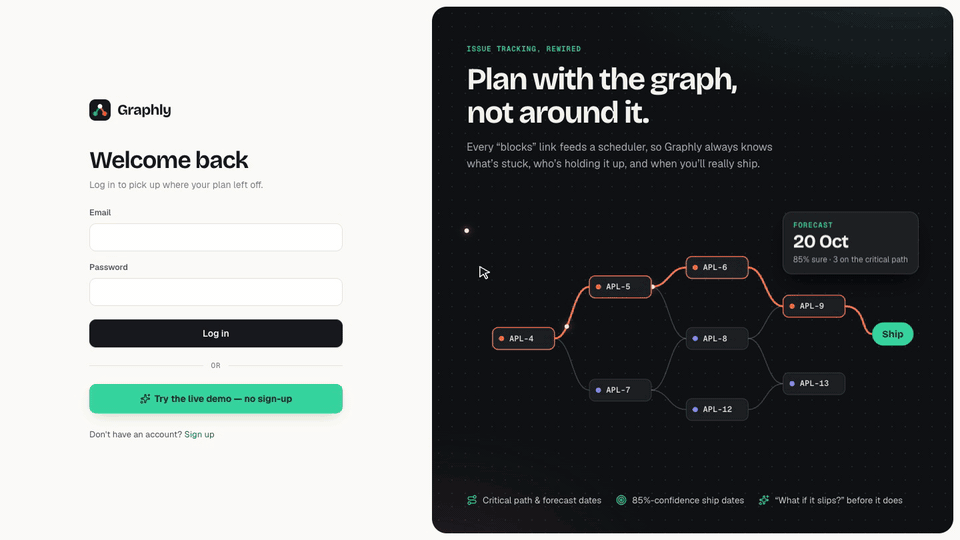

## Why

Trackers store "blocks" links and then ignore them. You can't see which issue is quietly holding up eight others, whether the due date is already lost, or what one slip does to the ship date. Graphly keeps the familiar workflow — projects, issue keys, a board, a list — and puts the graph underneath everything, so those answers are always on screen.

## What it does

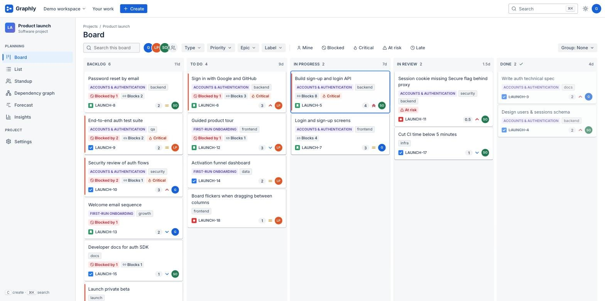

**Cards are graph nodes.** The port on a card's left edge counts the open work it waits on; the port on its right counts what waits on it. Blocked cards name their blocker ("Waiting on APL-5 +1"), and every open card shows its slack — or **critical** in coral when it has none. Hover a card to light up everything upstream and downstream of it.

**The forecast is always in view.** The sidebar carries the ship date, the 85%-confidence date, progress and the length of the critical path, on every page.

### See it in motion

<table>
  <tr>
    <td width="50%">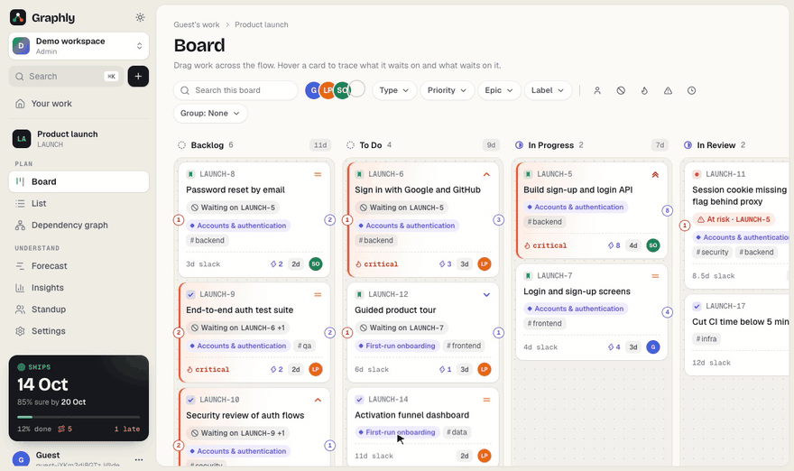</td>
    <td width="50%">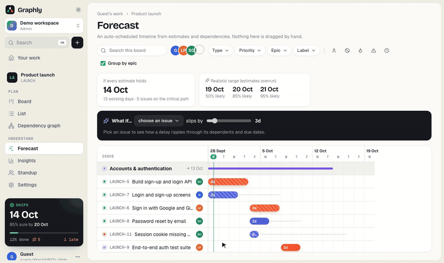</td>
  </tr>
  <tr>
    <td><b>Trace dependencies.</b> Hover a card to light up what it waits on (red) and what waits on it (indigo).</td>
    <td><b>What if it slips?</b> Drag the slider and watch the ship date, dependent bars and due dates move.</td>
  </tr>
  <tr>
    <td>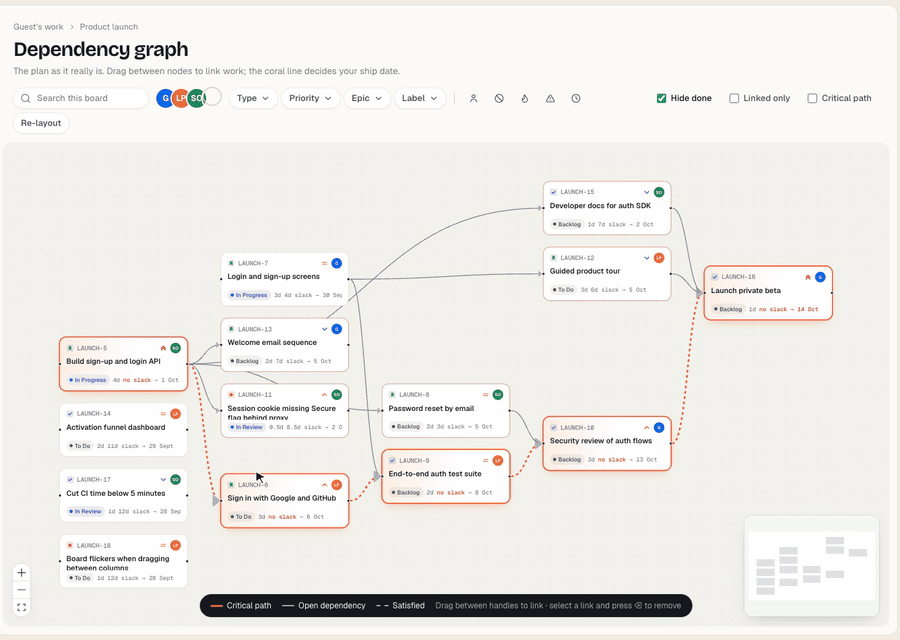</td>
    <td>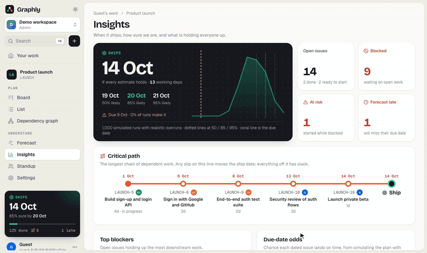</td>
  </tr>
  <tr>
    <td><b>Edit the graph.</b> Drag between nodes to link work. A link that would close a loop is refused.</td>
    <td><b>Know how sure you are.</b> The ship date with its Monte Carlo spread, and the critical path as a transit line.</td>
  </tr>
  <tr>
    <td>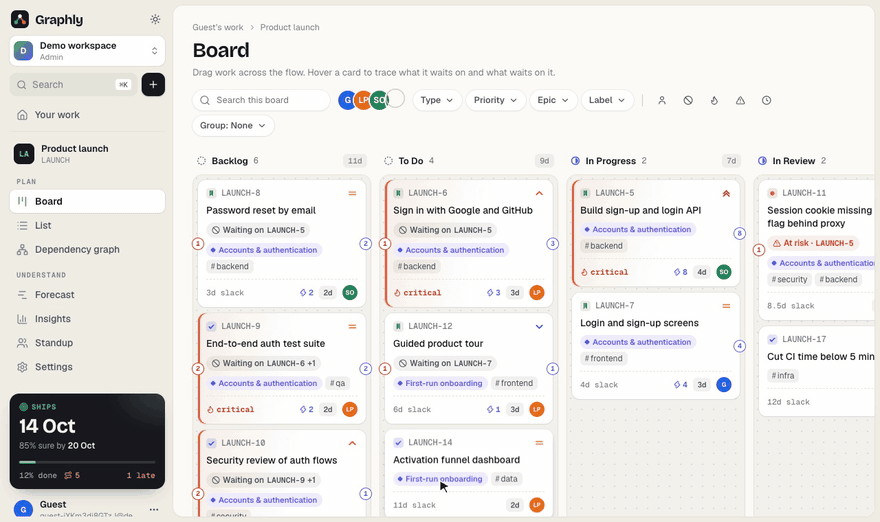</td>
    <td>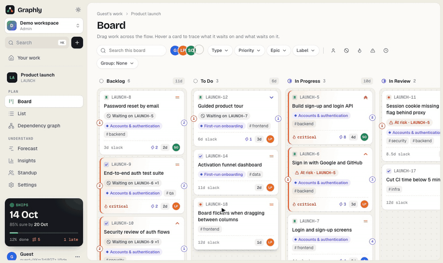</td>
  </tr>
  <tr>
    <td><b>Issues open beside the board.</b> Status, details and the issue's own forecast in one sheet.</td>
    <td><b>Light and dark.</b> Two tuned palettes, not an inversion.</td>
  </tr>
</table>

| | |
|---|---|
| **Forecast dates** | Every open issue gets a start and finish date from the critical path method over working days. Epics finish when their last child does. |
| **Confidence, not a guess** | 1,000 Monte Carlo runs with realistic overruns (bugs overrun most) turn one optimistic date into "50% by 19 Oct, 85% by 20 Oct", drawn as a distribution with the due date on it. |
| **Critical path** | The chain that decides the ship date, drawn as a transit line on Insights and in coral across the board, graph and timeline. |
| **Forecast timeline** | An auto-scheduled Gantt chart: bars, slack and due-date markers come from the dependencies, nothing is dragged by hand. |
| **What if it slips?** | Pick an issue and a delay to see the new ship date, every issue that shifts, and which due dates newly get missed. |
| **Blocker intelligence** | Blockers ranked by how much they transitively hold up; "at risk" for work started while blocked; "stale" for blockers nobody has touched in days. |
| **Late before it's late** | Issues whose *forecast* lands after their due date are flagged now, not on the day. |
| **People & bottlenecks** | Load per person split into critical-path and other work, context-switching warnings, and a suggested next task for each person. |
| **Standup** | What shipped, started, got unblocked or newly blocked since the last standup, and a plain-language account of what moved the date. Copies as a text update. |
| **Dependency graph** | A live DAG you edit by dragging between nodes. Cycles are rejected in the UI and, transactionally, on the server. |
| **GitHub** | Point a `pull_request` webhook at a project and any PR mentioning an issue key links to it and moves it forward: opened → review, merged → done. |
| **Real time** | Live presence shows who's here and who's viewing an issue; title and description saves use compare-and-swap, so simultaneous edits surface a conflict instead of overwriting. |

Also: workspaces and projects with issue keys (`APL-42`), stories / tasks / bugs / epics, a configurable workflow, swimlanes by assignee or epic, a sortable list, comments and full history, labels, priorities, due dates, filters, a ⌘K command palette, invite links with admin and member roles, and light / dark / system themes.

<table>
  <tr>
    <td>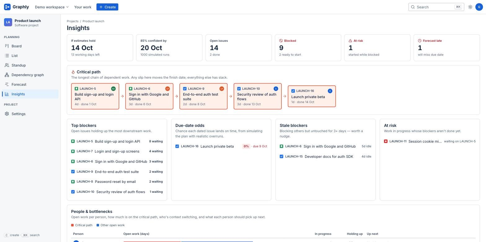</td>
    <td>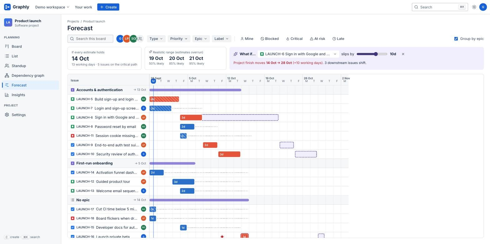</td>
  </tr>
  <tr>
    <td>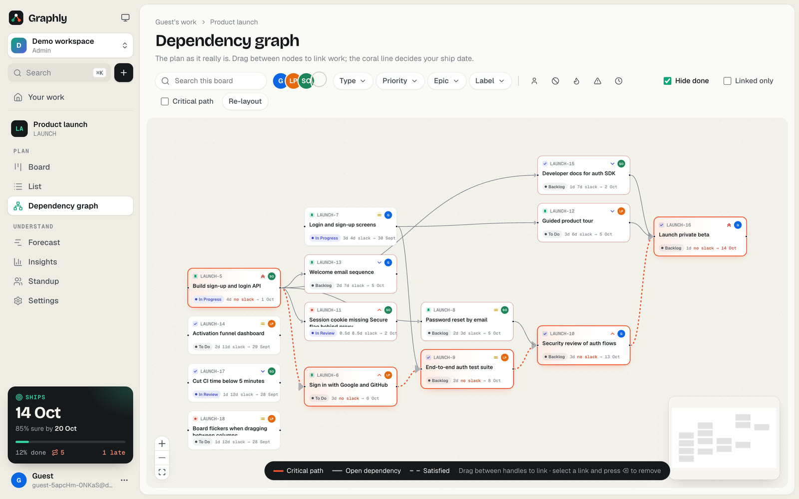</td>
    <td>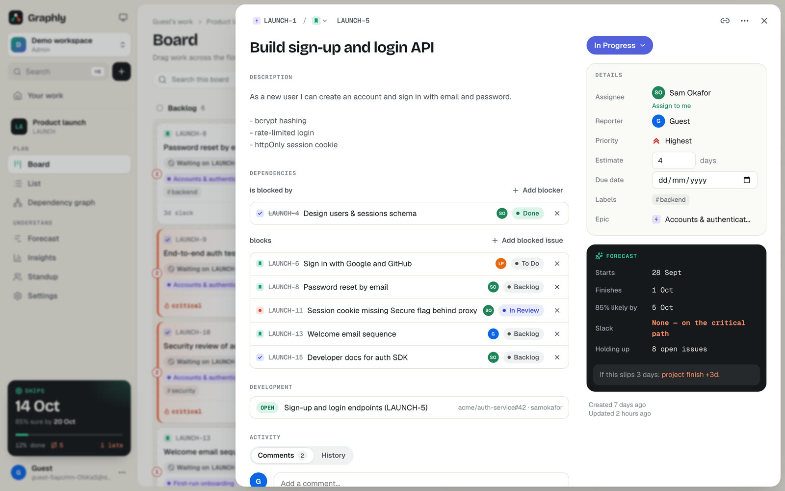</td>
  </tr>
  <tr>
    <td>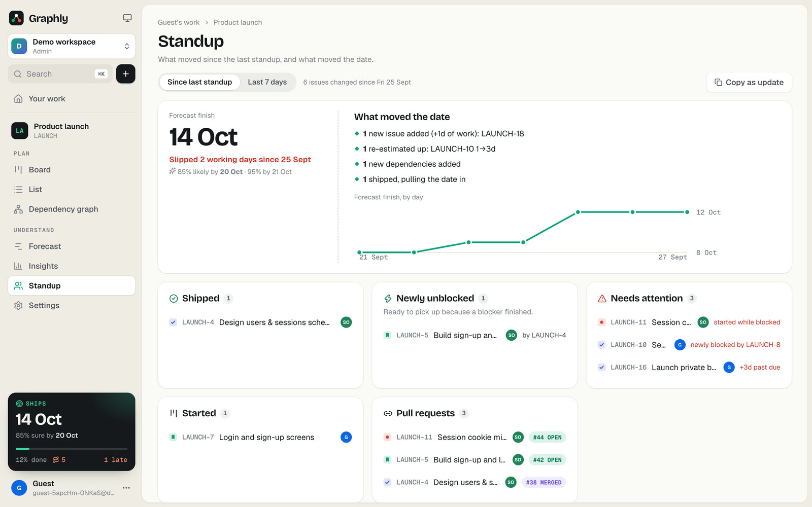</td>
    <td>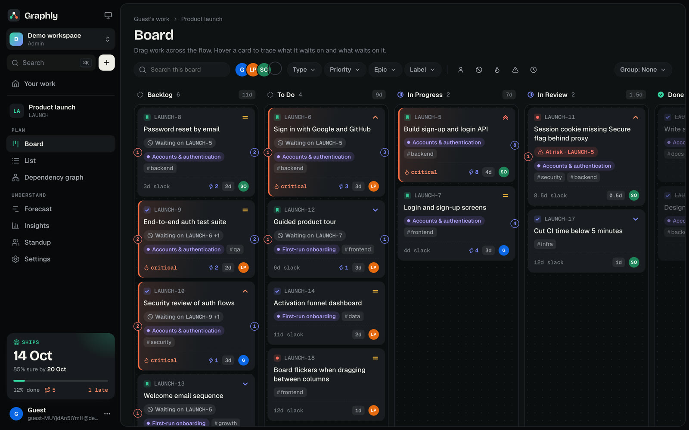</td>
  </tr>
</table>

## Design

Graphly borrows Jira's workflow, not its look. The interface is "graph paper": warm paper and ink in light mode, a tuned ink palette in dark, with one teal accent for progress, **coral reserved for the critical path**, and indigo for everything else that flows. Type is Bricolage Grotesque for headings and numbers, Geist for the interface and Geist Mono for keys and figures. A floating sidebar replaces the top bar, and issues open in a sheet beside the board rather than a modal over it.

## Architecture

```
web/      React + TypeScript (Vite). The graph engine, forecasting and Monte Carlo run client-side.
server/   Go (net/http, pgx, coder/websocket). Postgres is the source of truth.
```

- **Realtime:** every write records an event in an outbox table in the same transaction, then `pg_notify`s its id. Every server instance `LISTEN`s, so the design supports more than one instance (only one has been run so far). Clients resume from their last sequence number after a disconnect, and are asked to reload if the gap is older than the 24-hour retention window.
- **Integrity:** adding a dependency locks the project row and checks reachability with a recursive CTE, so two people linking A→B and B→A at the same moment can't create a cycle. `TestConcurrentOppositeLinks` covers this.
- **Forecast history:** the browser that has a project open reports the day's forecast (at most one row per project per day), which the Standup view uses to show how the date moved.
- **Auth:** bcrypt passwords and random 256-bit session tokens, stored hashed, in an `HttpOnly`, `SameSite=Lax` cookie. State-changing requests require JSON and a same-origin `Origin` header. Login and demo creation are rate-limited per IP. Access is enforced per workspace on every route and WebSocket.
- **Demo:** "Try the live demo" creates a guest account and workspace with a sample project and two teammates. Guests and their workspaces are deleted after seven days.

## Development

Prerequisites: Go 1.26+, Node 22+, Postgres 15+.

```sh
createdb graphly

# API on :8080 (runs migrations on boot)
cd server && go run .

# Frontend on :5173, proxying /api to the Go server
cd web && npm install && npm run dev
```

If port 8080 is taken, run the server with `ADDR=:8090` and the frontend with `GRAPHLY_API=http://localhost:8090 npm run dev`. See `.env.example` for all settings. When you create a project, tick **Include a sample plan** for an 18-issue launch with a due date that's already at risk. `scripts/dev-accounts.example.json` lists throwaway accounts you can sign up with locally to try multi-user presence.

### Tests

```sh
createdb graphly_test
cd server && go test -race ./...   # API, auth, realtime, concurrency, demo, GitHub webhook (needs Postgres; wipes graphly_test)
cd web && npm test                 # graph engine, forecasting, Monte Carlo
```

## Deploying

The `Dockerfile` builds a single distroless image: the Go binary serves the API, WebSockets and the built SPA.

```sh
docker compose up --build     # Postgres + Graphly on http://localhost:8080
```

The live site runs on **Fly.io** (`fly.toml`, region `sin`) with **Supabase** Postgres:

```sh
fly secrets set DATABASE_URL='postgresql://…:5432/postgres?sslmode=require'
fly deploy
```

Use a direct or session-mode connection, not a transaction pooler: the realtime hub holds a `LISTEN` connection. `fly.toml` already sets `SECURE_COOKIES=true` and `CLIENT_IP_HEADER=Fly-Client-IP`. Any container host works the same way.

### GitHub integration

In a project's **Settings → GitHub**, enable the integration to get a webhook URL and secret, then add a repository webhook for **Pull requests** with content type `application/json`. Issues only ever move forward, so a late webhook can't drag finished work backwards.
